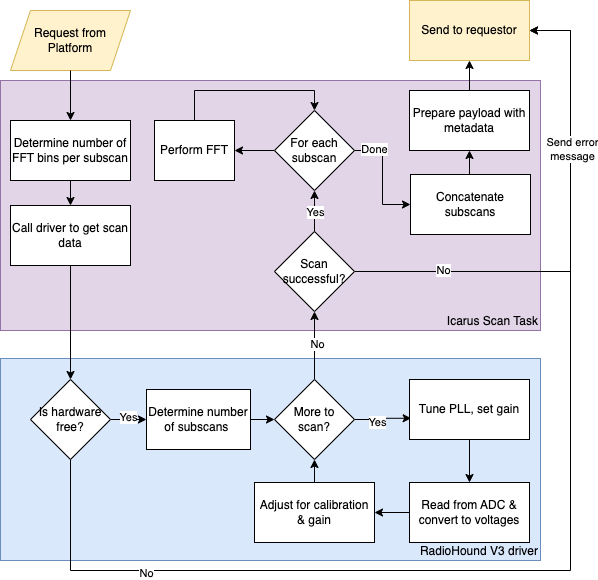

# Connecting to the RadioHound Platform 

The RadioHound platform is built around scanning, visualizing and reporting fft-based spectrum data.  Scan data can be requested from the platform in "real-time", collected as part of an Experiment or from a standalone script.  
[RadioHound Platform Architecture Diagram](https://raw.githubusercontent.com/ndwireless/radiohound/main/docs/RadioHound%20Platform%20Architecture.png)

There are two ways to connect a third-party sensor to the RadioHound platform: 
- Write a [Standalone Script](#standalone-script) to send in data via MQTT directly.
- Using a [RadioHound compatible stack](#radiohound-compatible-stack) (a BeagleBone Black with our _Icarus_ software) and writing a driver to interface with the SDR of your choice.


## Standalone Script
A standalone script to send in [scan data](#scan-data) directly can be written in the language of your choice, provided it has an MQTT library compatible with the Mosquitto broker.  But first, you must identify your sensor on the platform by sending a JSON-formatted message to the topic `radiohound/clients/announce/MAC_ADDRESS` containing at a minimum:

```javascript
{
   "message":"INITIAL",
   "payload":{
      "mac_address":"XXXXXXXXXXXX",           //wired ethernet mac, used as primary key for everything
      "latitude":41.69955333118339,
      "longitude":-86.23723130815955,
      "IP_addr":"10.1.1.1",
      "display_name":"Generic B210 - 000",    //automatically created from group name and RadioHound version/serial
      "hostname":"XXXX",                      //last 4 characters of mac address
   }
}
```
The full list of announce options is available at [Announce](announce.md).  There is no requirement to send continual heartbeat packets after the first, however nodes are marked offline after 20 seconds.  This does not affect the ability to send data.  


Example Python pseudo-code is below. The separate functions mimics the RadioHound stack and provides a path for integration down the line.  
```python
#!/usr/bin/python3
import paho.mqtt.client as mqtt
client = mqtt.Client()                           # Create MQTT object
client.connect('radiohound.ee.nd.edu', 1883, 60) # Requires firewall access
send_heartbeat()                                 # User provided function to identify your node
raw_data = get_data()                            # User provided driver code to interact with SDR 
payload = process_data(raw_data)                 # User provided for FFT processing, if desired.  See 'Example from RadioHound' below
client.publish("radiohound/clients/data/MAC_ADDRESS", payload=json.dumps(payload))
```


## Scan Data


Scan data is a discrete estimate of the power spectrum over the given span with bins of width RBW.  The data is stored in a Float32/Single array (adhering to the IEEE754 Standard). The length of the array is N_periodogram_points and the float values are stored in a little endian byte order. When creating the JSON payload for transmission, the data field should encoded using the Base64 alphabet defined in RFC 4648.


### Example from RadioHound:
```python
#!/usr/bin/python3
def process_data(raw_data):
  payload = {...}   # See below
  _, fft = signal.welch(raw_data,
      fs=frequency_span,
      scaling='spectrum',
      nperseg=int(nperseg),
      return_onesided=False)
    fft = fft/(2*50) # Scale by rms factor and resistance to go from V^2 to Watts
  payload['data'] = base64.b64encode(fft)
  return(payload)
```

Snippet of `fft` from above:
```python
[4.3782336e-13 1.8301725e-12 1.8585157e-12 ... 1.4869207e-12 1.7660220e-12 1.6855774e-12]
```

## Scan Payload - FFT

The minimum required scan payload is:

```python
{
   "data": base64.b64encode(fft),            #Base64 encoded array of float32 values
   "type":"float32",
   "mac_address":"XXXXXXXXXXXX",
   "short_name":"Generic B210 - 000",
   "latitude": latitude,
   "longitude": longitude,
   "sample_rate":24000000.0,
   "center_frequency":2000000000.0,
   "timestamp":"2023-05-26T18:24:53.958385+00:00",
   "metadata":{
      "data_type":"periodogram",
      "fmin":1988000000.0,                   #Return actual scan boundaries based on hardware capabilities
      "fmax":2012000000.0,
      "n_periodogram_points":1024.0,         #Number of fft bins
    }
}
```
The full payload is available at [Scan Data](scandata.md)

## Raw scan data
Raw data can be sent in and setting the `data_type` field appropriately:  

```python
{
   "data": base64.b64encode(raw_data),       #Base64 encoded array of float32 values
   "type": "float32"
   "mac_address": "XXXXXXXXXXXX",
   "short_name": "Generic B210 - 000",
   "latitude": latitude,
   "longitude": longitude,
   "sample_rate":24000000.0,
   "center_frequency":2000000000.0,
   "timestamp":"2023-05-26T18:24:53.958385+00:00",
   "metadata": {
     "data_type": "raw",
     "fmin":1988000000.0,                     #Return actual scan boundaries based on hardware capabilities
     "fmax":2012000000.0,}
}
```


## RadioHound Compatible Stack
The RadioHound software stack, called Icarus, is written in Python3 and handles everything from receiving commands and performing scans, to sending heartbeats and scheduling experiment jobs. 

The subsystems reponsible for receiving and performing a scan request:




### Scan Task

The inputs are verified and if the requested span is larger than sensor bandwidth, it is broken up into sub-scans which get stitched together before sending. 

Snippet from tasks.rf.scan.py:
```python
def periodogram(node,args):
  """
  args = {
    'task_name': 'tasks.rf.scan.periodogram',
    'arguments': {
      'fmin': 100e6,
      'fmax': 110e6,
      'N_periodogram_points': 1024,
      'output_topic': 'radiohound/clients/data/MAC_ADDRESS/UUID'
      }}
  """
  ...
  data = receiver.scan(...)
```

We call the driver code to handle locking and reading from the RF sensor.  


### Driver Code
We have an inheritable _Receiver_ class with the following methods:

```python
class Receiver(object):
    def __init__(self,hardware_id=None,
      frequency_min=None, frequency_max=None,
      sample_rate_min=None, sample_rate_max=None,
      gain_min=None, gain_max=None,
      N_samples_min=None, N_samples_max=None,
      timeout=None):

    def scan(self,frequency_start,frequency_end,
      N_samples=None,rbw=None,
      ibw=None,sample_rate=None, gain=1):
        ...
        return _collect_sensor_data()

    def raw(self, center_frequency, gain=1):
        ...
        return _collect_sensor_data()

    def _collect_sensor_data():
      pass
```

And our V3 driver class:

```python
class RadioHoundSensorV3(Receiver):    
    def __init__(self,hardware_id=0,
      frequency_min=48e6, frequency_max=6e9,
      sample_rate_min=24e6, sample_rate_max=24e6,
      gain_min=-5, gain_max=40,
      N_samples_min=1, N_samples_max=2**22,
      timeout=0.2):

      Receiver.__init__(...)
      # default values
      self._frequency = 1e9
      self._sample_rate = 24e6
      self._gain = 1  #dB
      self._buffer_size = 1024 * 1024
      self._N_samples = int(self._buffer_size / 2)


    def _collect_sensor_data(self):
        # Read from ADC & apply calibration 
        return data
  ```